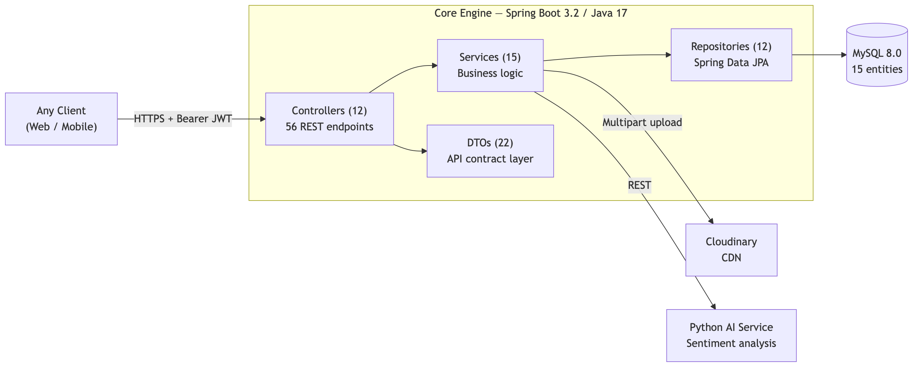
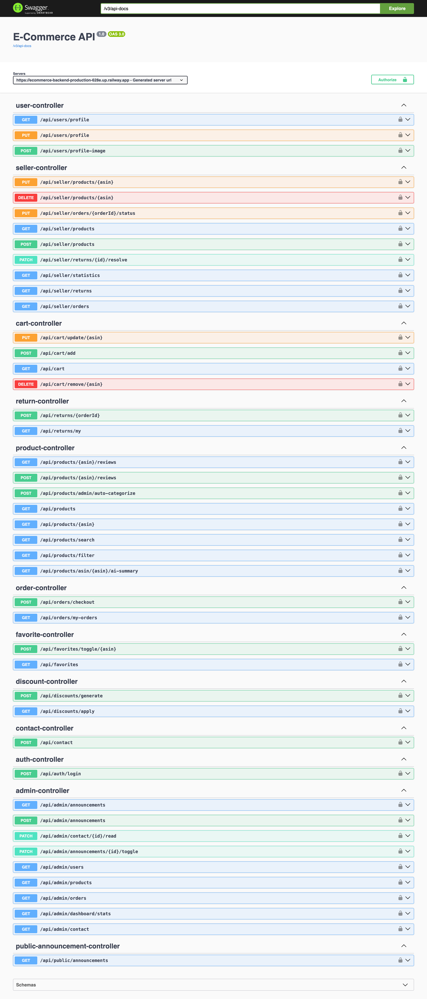
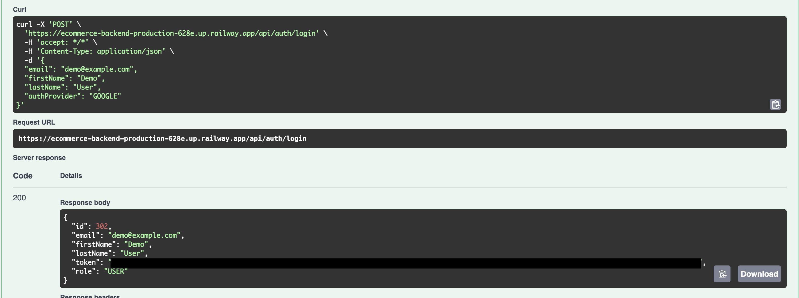
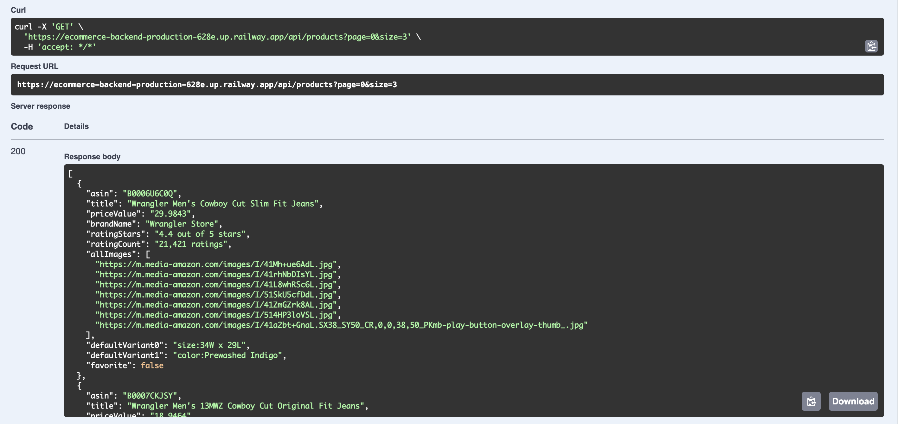
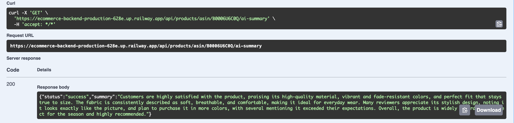
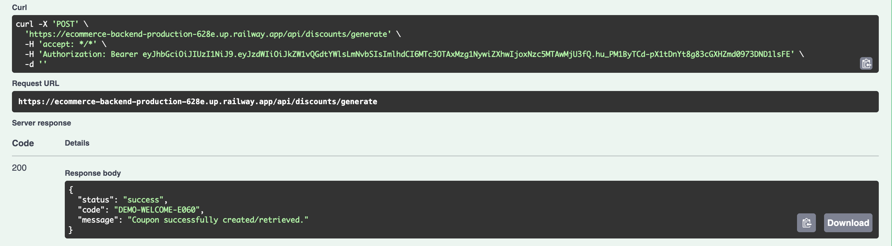

# E-Commerce Marketplace API

> A **headless commerce backend** designed as a contract-first API for a full-stack e-commerce marketplace. Built to be consumed by any client (web, mobile, partner) through a single OpenAPI 3.0 contract.

[](https://openjdk.org/)
[](https://spring.io/projects/spring-boot)
[](https://www.python.org/)
[](https://flask.palletsprojects.com/)
[](https://www.mysql.com/)
[](https://jwt.io/)
[](https://swagger.io/)

---

## Positioning: Why "Backend-as-a-Service"?

This service is **not** a monolithic e-commerce app. It is a **headless REST API** exposing a complete marketplace domain — catalog, cart, orders, returns, sellers, admin, AI insights — through **56 endpoints** under a single OpenAPI contract.

The design assumes the consumer (frontend, mobile app, partner integration) is built and deployed separately, communicating with this engine purely over HTTP. That assumption shapes every architectural choice:

- **Stateless JWT authentication** — no session affinity, horizontally scalable
- **DTO-first response shaping** — 22 DTOs distinct from 15 JPA entities; internal model never leaks to consumers
- **Swagger UI as the living contract** — `/swagger-ui.html` is the single source of truth for endpoint discovery
- **CORS opened at the gateway** — frontend can be hosted on any origin

---

## High-Level Architecture



---

## Key Features

### 1. JWT Authentication — Passwordless, Provider-Aware

The auth model deliberately departs from username/password. The client handles OAuth (Google, etc.) and passes only the verified identity to `/api/auth/login`:

```java
// Single endpoint handles both "Login" and "Register" cases idempotently
POST /api/auth/login
{ "email": "user@example.com", "firstName": "Ada", "lastName": "Lovelace",
  "authProvider": "GOOGLE" }

// Response
{ "id": 1, "email": "user@example.com", "token": "eyJhbGciOi...", "role": "USER" }
```

**Pipeline:**

- `JwtService` — HS256 signing, 24-hour TTL, claims = `subject(email)`
- `JwtAuthenticationFilter` extends `OncePerRequestFilter` — extracts `Authorization: Bearer ...`, validates, populates `SecurityContext` with `SimpleGrantedAuthority(role)`
- Case-insensitive email normalization with fallback lookup
- Anonymous requests fall through silently — only `permitAll()` matchers serve them

### 2. Role-Based Access Control — 3-Tier RBAC

Authorization is enforced **declaratively at the security filter chain**, never scattered through business code:

| Role | Path Prefix | Permissions |
|------|-------------|-------------|
| `ADMIN` | `/api/admin/**` | Dashboard stats, all orders, all products, announcements |
| `SELLER` | `/api/seller/**` | Own products CRUD, own orders, statistics, return resolution |
| `USER` | `/api/cart`, `/api/orders`, `/api/favorites`, `/api/returns` | Customer journey |
| Public | `/api/auth/**`, `/api/products/**` (GET), `/api/public/**` | Catalog browsing |

Method-level `@PreAuthorize("hasAuthority('SELLER')")` provides a second defense layer on sensitive controllers.

### 3. Cloudinary Integration — Multipart-Aware CDN Upload

A dedicated `CloudinaryService` wraps the SDK and is injected wherever image persistence is needed:

```java
@PostMapping(value = "/profile-image", consumes = MediaType.MULTIPART_FORM_DATA_VALUE)
public ResponseEntity<String> uploadProfileImage(
        Authentication authentication,
        @RequestParam("file") MultipartFile file) throws IOException {
    String photoURL = cloudinaryService.uploadImage(file);
    userService.updatePhotoURL(authentication.getName(), photoURL);
    return ResponseEntity.ok(photoURL);
}
```

Only the **secure HTTPS URL** is persisted to MySQL — the binary lives entirely on Cloudinary's CDN, decoupling storage from the application server.

### 4. Python AI Bridge — Microservice Integration

`AiBridgeService` is a thin HTTP adapter that forwards review payloads to an independent Python service for sentiment summarization:

```java
public String analyzeReviews(List<String> reviews) {
    try {
        Map<String, Object> request = Map.of("reviews", reviews);
        return restTemplate.postForObject(AI_SERVICE_URL, request, String.class);
    } catch (Exception e) {
        return "Review analysis is currently unavailable: " + e.getMessage();
    }
}
```

- Java owns the **data contract** (which reviews, which product); Python owns the **ML pipeline**.
- Failure is **degraded, not fatal** — the catch block returns a graceful message so the product page still renders.
- `GET /api/products/asin/{asin}/ai-summary` is the single integration point.
- **Codebase:** Python source (`main.py`, `requirements.txt`) in the `ecommerce-ai-service/` directory.
- **Deployment:** Deployed independently via **Railway**.

---

## API as the Contract

The only public artifact this backend produces is its **OpenAPI 3.0 schema**, auto-generated by `springdoc-openapi`:

| Concern | Mechanism |
|---------|-----------|
| **API discovery** | `/v3/api-docs` (JSON) and `/swagger-ui.html` (interactive) |
| **Auth scheme** | `SwaggerConfig` declares `bearerAuth` — UI prompts for the JWT |
| **Data shape** | DTOs (`ProductDto`, `ProductDetailDto`, `OrderItem`...) — never raw entities |
| **Versioning** | URI prefix `/api/...` reserved for future `/api/v2/...` |
| **CORS** | `setAllowedOriginPatterns("*")` — clients host independently |
| **Error semantics** | HTTP status codes (`401`, `403`, `404`, `500`) + JSON body |
| **Field validation** | `@Valid` + Jakarta Validation on DTOs |

### DTO Discipline

Persistence entities carry JPA annotations, `@JsonIgnore` on relations, lazy-loading proxies — they are **never** exposed directly. Each operation has a dedicated DTO:

```
Entity (DB layer)  →  Service         →  DTO (API layer)
──────────────────    ─────────────      ───────────────
User               →  UserService     →  UserProfileDto, UserResponseDto, AuthResponse
Product            →  ProductService  →  ProductDto, ProductDetailDto, AdminProductDto
ProductReview      →  ReviewService   →  ReviewDto, ReviewRequest
DiscountCoupon     →  DiscountService →  CouponResponseDto, DiscountApplyResponseDto
```

22 DTOs vs 15 entities — schema changes to the DB do not break the API contract.

---

## Database Seeding

A marketplace with zero products has no demo surface. `DataSeederService` solves this by ingesting two CSV files at application startup:

| File | Rows | Columns | Purpose |
|------|------|---------|---------|
| `products.csv` | 728 | 28 | Preprocessed Amazon product dataset |
| `reviews.csv` | 6,356 | 13 | Reviews keyed by `productasin` |

### Algorithm — Idempotent, Self-Healing, Cached

Key decisions:

1. **Idempotent on restart** — `count() == 0` guard prevents duplicate ingestion.
2. **In-memory seller cache** — same brand on 50 products = 1 DB write, not 50. O(n) vs O(n²).
3. **Deterministic email slugging** — `"Calvin Klein"` → `calvin-klein@ecommerce.com`. Collision-safe via DB unique constraint.
4. **Two-pass safety net** — `assignOwnersToOrphanProducts()` retroactively links any product whose `owner` is null.
5. **Graceful per-row failure** — a malformed row logs and continues; the batch never aborts.

Result: **a single `mvn spring-boot:run` produces a fully populated, demo-ready marketplace** — zero manual seeding.

---

## Domain Model

15 entities total: `User · Product · ProductImage · ProductReview · Cart · CartItem · Order · OrderItem · Favorite · ReturnRequest · DiscountCoupon · SystemAnnouncement · ContactMessage`.

---

## API Screenshots

> Screenshots produced against the live seeded database via Swagger UI.

### Swagger UI — All 56 Endpoints



*Twelve controller groups with `bearerAuth` security applied globally.*

### Authentication — Issuing a JWT



*`POST /api/auth/login` returns a 24-hour HS256-signed JWT plus the user's role.*

### Product Catalog — Real Seeded Data



*`GET /api/products` returning seeded products with full metadata.*

### AI-Powered Review Summary



*`GET /api/products/asin/{asin}/ai-summary` — response produced by the Python sentiment service.*

### Authenticated Discount Generation



*`POST /api/discounts/generate` — JWT-authenticated endpoint, coupon generated on first order.*

---

## API Surface

| Group | Endpoints | Highlights |
|-------|-----------|------------|
| `/api/auth` | 1 | `POST /login` — passwordless register-or-login |
| `/api/products` | 8 | List, detail, search, filter, reviews, AI summary |
| `/api/cart` | 4 | Add / view / remove / update quantity |
| `/api/orders` | 2 | Checkout, my-orders |
| `/api/favorites` | 2 | Toggle, list |
| `/api/discounts` | 2 | Generate first-order coupon, apply coupon |
| `/api/returns` | 2 | Create return, my returns |
| `/api/users` | 3 | Profile read / update, profile image upload |
| `/api/seller/**` | 9 | Product CRUD, orders, statistics, return resolution |
| `/api/admin/**` | 9 | Dashboard, user/product listings, announcements |
| `/api/contact` | 1 | Anonymous contact form |
| `/api/public/**` | 1 | Public announcements |
| **Total** | **56** | |

---

## Local Development

### Prerequisites

- Java 17+
- Maven 3.8+
- MySQL 8.0 on `localhost:3307`
- Cloudinary account (free tier sufficient)

### Run

```bash
git clone https://github.com/kaangulerr/ecommerce-api.git
cd ecommerce-api/ecommerce-backend
./mvnw spring-boot:run
```

On first start:

```
INFO  DataSeederService - Seeding started (Safe Mode)...
INFO  DataSeederService - Products loaded: 728
INFO  DataSeederService - Seeding complete
```

Swagger UI: `http://localhost:8080/swagger-ui.html`

---

## Security Hardening

- [x] Externalize JWT `SECRET_KEY` — loaded from `JWT_SECRET` environment variable
- [x] Remove Cloudinary credentials from VCS — loaded from `CLOUDINARY_*` environment variables
- [ ] Add refresh-token rotation — current 24h access token forces re-login
- [ ] Tighten CORS in production — replace `allowedOriginPatterns("*")` with explicit whitelist
- [ ] Custom exception hierarchy + `@ControllerAdvice` — replace `RuntimeException` with typed exceptions
- [ ] Rate-limit `/api/auth/login`
- [ ] Integration tests — currently only `contextLoads()`

---

## License

This project is licensed under the MIT License - see the [LICENSE](LICENSE) file for details.


